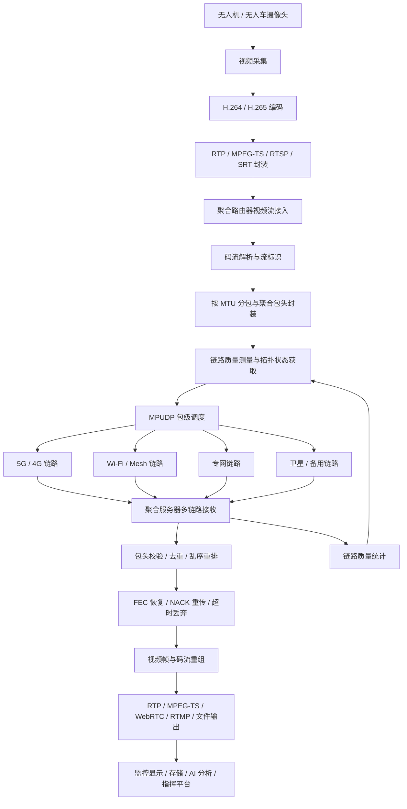
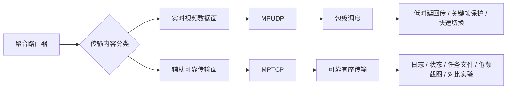
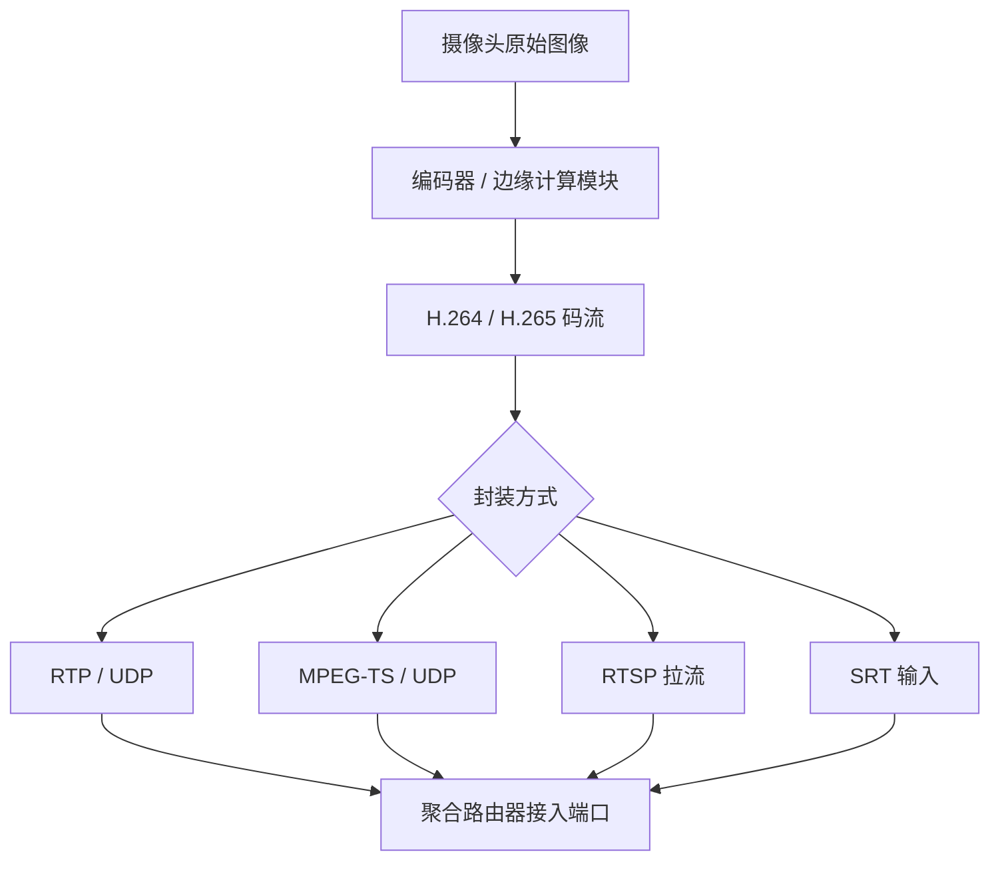
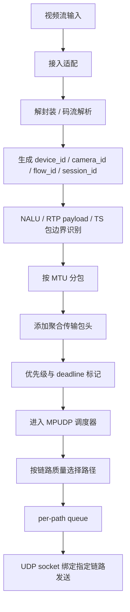
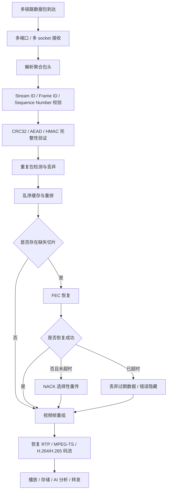
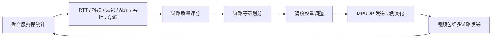

# 第 1 章 异构聚合网络视频回传系统概述

本系统重点关注视频流进入聚合路由器之后，经由多条异构链路传输到聚合服务器，并在服务器侧完成接收、校验、重排、恢复、输出和质量反馈的全过程。

全文技术路线以 MPUDP 作为实时视频数据主传输方案，以 MPTCP 作为辅助可靠传输和对比方案。MPUDP 负责低时延视频包级调度，MPTCP 主要承载日志、状态、任务文件、低频图像和对照实验视频流。

## 1.1 文档定位与研究目标

本文档面向无人机、无人车实时图像回传场景，研究聚合路由器到聚合服务器之间的异构聚合传输过程。无人机和无人车通常处于移动、遮挡、链路波动和多网络并存环境中，单一通信链路难以稳定满足实时视频回传需求，因此需要通过多链路聚合提高链路可用性、传输连续性和视频质量稳定性。

本文档的研究目标包括：

- 明确无人机、无人车视频流进入聚合路由器前后的处理过程。
- 说明聚合路由器、异构链路和聚合服务器之间的系统架构。
- 确定以 MPUDP 为主、MPTCP 为辅的传输技术路线。
- 分析多路径视频传输中的乱序、丢包、重复、差错和安全问题。
- 建立链路质量测量、拓扑发现、评分反馈和调度联动机制。
- 给出实验环境、验证指标和基础技术层输出内容。

本文档不重点展开摄像头硬件选型、无人机飞控、无人车运动控制、AI 识别算法内部实现和上层业务平台开发，而是将这些部分作为系统外部输入或后续输出。

## 1.2 全过程总体流程

无人机、无人车实时视频回传的整体流程可以分为视频产生、视频接入、聚合传输、服务器恢复和质量反馈五个阶段。

该流程体现了两个关键思想：

- 视频数据在进入网络前已经完成编码和基础封装，聚合路由器主要做接入适配、分包、标识和多链路调度。
- 聚合服务器不是简单收包节点，而是需要完成多路径接收后的差错检测、乱序重排、丢包恢复、视频重组和链路质量反馈。

## 1.3 文档章节关系

第 2 章到第 11 章共同描述上述全过程。各章节之间的关系如下：

| 章节 | 主题 | 在全过程中的作用 |
|---|---|---|
| 第 2 章 应用场景与业务需求 | 无人机、无人车视频流处理与业务需求 | 明确视频从采集、编码、封装到进入聚合路由器的前置处理，并确定 MPUDP 主用、MPTCP 辅助的路线 |
| 第 3 章 异构聚合网络架构 | 聚合路由器、异构链路、聚合服务器 | 定义系统组成、设备形态、网络接口、隧道和服务器功能 |
| 第 4 章 传输协议 | RTP/RTCP、GB/T 28181、SIP、MPUDP、MPTCP、SCTP | 说明视频接入协议、控制信令、多路径传输协议基础和具体传输流程 |
| 第 5 章 多路径视频传输差错控制与安全机制 | 包头、校验、加密、乱序、丢包恢复 | 解决多链路传输中错误数据、重复包、乱序包和丢包恢复问题 |
| 第 6 章 异构网络拓扑发现与存储 | 拓扑发现、链路信息、存储模型 | 为链路调度和状态管理提供网络结构信息 |
| 第 7 章 网络质量测量基础 | RTT、抖动、丢包、带宽、QoE | 为链路评分和调度决策提供实时指标 |
| 第 8 章 基础安全技术 | 认证、加密、完整性、防重放 | 保障设备接入可信和视频数据安全 |
| 第 9 章 实验环境 | 仿真环境、容器、网络损伤、验证路线 | 支撑实验模型搭建和算法验证 |
| 第 10 章 基础技术层输出内容 | 能力输出、约束、指标和评分公式 | 将基础技术层结果提供给调度层和评估层 |
| 第 11 章 小结 | 总结与后续方向 | 汇总系统基础能力和后续研究重点 |

## 1.4 数据面与辅助面的总体设计

本系统将聚合路由器到聚合服务器之间的传输划分为实时视频数据面和辅助可靠传输面。

实时视频数据面以 MPUDP 为主，原因是无人机、无人车图像回传更关注低时延、连续性和可控调度。MPUDP 允许聚合路由器显式控制每个视频包走哪条链路，并可以结合链路状态、视频帧类型和传输截止时间进行灵活调度。

辅助可靠传输面以 MPTCP 为辅。MPTCP 适合可靠有序数据传输，能够利用多条链路提高容灾能力，但由于继承 TCP 的重传等待和队头阻塞问题，不适合作为强实时视频主通道。它更适合承载日志、状态信息、任务记录、低频截图、配置文件和对比实验视频流。

## 1.5 视频流进入聚合路由器前的处理

无人机、无人车上的视频数据在进入聚合路由器之前，通常已经完成图像采集、视频编码和基础封装。

这一阶段的核心不是改变视频内容，而是将原始图像压缩成适合移动网络传输的编码码流。实际系统中应关注分辨率、帧率、码率、编码格式、关键帧间隔和视频路数，因为这些参数直接决定聚合链路需要承载的数据规模。

在实验模型中，推荐优先使用 RTP/UDP 或 MPEG-TS/UDP 作为聚合路由器输入格式。这两类格式低时延、易抓包、易与 FFmpeg 和 GStreamer 对接，也便于后续进行包级调度和服务器端重组。

## 1.6 聚合路由器侧处理流程

聚合路由器是系统发送侧核心节点。它接收上游视频流后，需要完成接入适配、码流解析、流标识、分包、封装、链路选择和发送队列管理。

聚合路由器侧需要重点保证三件事：

- 能够区分不同无人平台、不同摄像头和不同会话的视频流。
- 能够控制聚合数据包大小，避免超过路径 MTU 后发生 IP 分片。
- 能够根据链路状态将视频包动态分配到不同链路。

对于 I 帧、SPS/PPS、关键切片等重要数据，可设置更高优先级或进行跨链路冗余发送。对于已经超过实时传输截止时间的普通帧，可以选择丢弃，避免队列积压导致后续画面整体延迟升高。

## 1.7 异构链路传输过程

聚合路由器和聚合服务器之间可能同时存在 5G/4G、Wi-Fi、专网、Mesh、卫星和有线链路。不同链路具有不同的带宽、时延、抖动、丢包和可用性。

在实际无人机回传中，5G/4G 公网链路可承担主要视频数据，专网链路可承担关键帧或公网弱覆盖时的接管任务，卫星链路可作为极端场景下的低码率兜底链路。

在实际无人车回传中，多运营商 5G/4G 可降低单运营商覆盖盲区风险，Wi-Fi 或 Wi-Fi Mesh 适合园区、港口、矿区和仓库等局部区域的高带宽回传，专网或 Mesh 电台可作为任务区域内的稳定辅助链路。

MPUDP 调度器需要持续参考链路质量指标，动态调整各链路权重。例如：

- 低 RTT、低丢包链路优先承载关键帧和主摄像头视频。
- 高带宽但抖动较大的链路可承载普通帧或辅助摄像头视频。
- 高时延链路可作为备份、冗余或低码率兜底链路。
- 丢包率持续升高或心跳超时的链路应降低权重或临时剔除。

## 1.8 聚合服务器侧恢复流程

聚合服务器是系统接收侧核心节点。多条链路到达的数据包可能乱序、重复、迟到或缺失，因此服务器必须在视频输出前完成差错检测和恢复。

服务器侧处理的核心原则是：能够恢复的尽量快速恢复，不能按时恢复的及时丢弃。实时视频不适合无限等待重传，否则会造成画面延迟持续积累。对于关键帧丢失、连续参考帧不可恢复等情况，可通过 RTCP PLI/FIR 或自定义反馈请求新的关键帧。

## 1.9 链路质量反馈与调度闭环

异构聚合视频回传不是一次性发送过程，而是一个持续反馈和动态调整的闭环系统。聚合服务器需要将接收侧观测到的链路质量反馈给聚合路由器，聚合路由器再根据反馈调整 MPUDP 调度策略。

链路质量评分可综合考虑带宽、RTT、丢包率、抖动、队列延迟和链路在线状态。评分结果可用于判断链路属于 ACTIVE、DEGRADED、FAILED 或 RECOVERING 状态，并驱动包级调度、冗余发送和故障恢复策略。

## 1.10 实验验证总体路线

实验环境用于验证上述传输过程是否有效。建议从简单到复杂逐步推进：

1. 单链路视频回传验证：确认视频流接入、封装、发送、接收和恢复输出流程可用。
2. 多链路静态调度验证：测试轮询、加权、主备等基础 MPUDP 调度策略。
3. 异构链路损伤验证：通过带宽限制、时延、抖动、丢包、乱序和链路中断模拟真实环境。
4. 差错控制验证：测试 FEC、NACK、重排缓存、重复包消除和超时丢弃效果。
5. 安全机制验证：测试身份认证、加密、完整性校验和防重放能力。
6. 质量评分与闭环调度验证：验证链路质量评分是否能有效驱动 MPUDP 动态调度。
7. MPUDP 与 MPTCP 对比验证：比较两者在吞吐、时延、卡顿、故障切换和视频恢复质量上的差异。

实验可通过 Docker、Docker Compose、Linux network namespace、veth、tc netem、FFmpeg、GStreamer、tcpdump、Wireshark、Prometheus 和 Grafana 等工具构建。

## 1.11 本章小结

异构聚合视频回传系统的核心，是在无人机、无人车复杂移动网络环境下，将多条链路统一纳入可感知、可调度、可恢复、可评估的传输体系。

从全过程看，视频流先完成采集、编码和封装，再进入聚合路由器；聚合路由器对视频流进行标识、解析、分包和 MPUDP 调度；视频包经由多条异构链路到达聚合服务器；服务器完成校验、去重、重排、恢复和输出；最后服务器将链路质量和视频质量反馈给聚合路由器，形成持续优化的闭环。

本文档后续章节将围绕这一流程展开，分别说明业务需求、网络架构、协议基础、差错控制、拓扑发现、质量测量、安全机制、实验环境和基础技术层输出。
